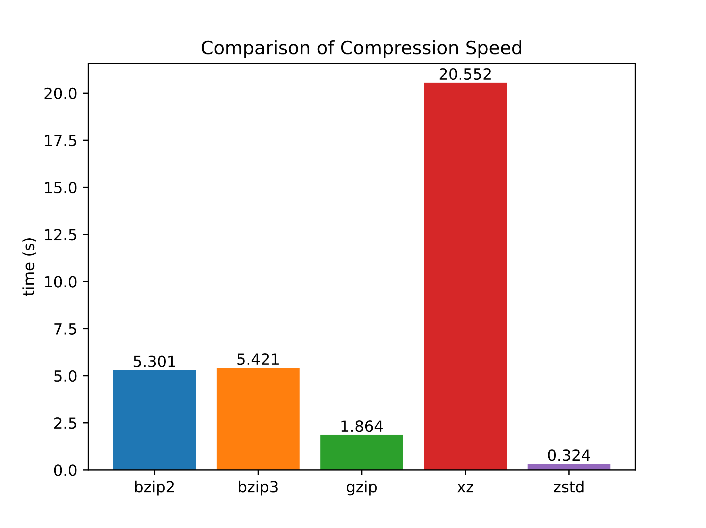
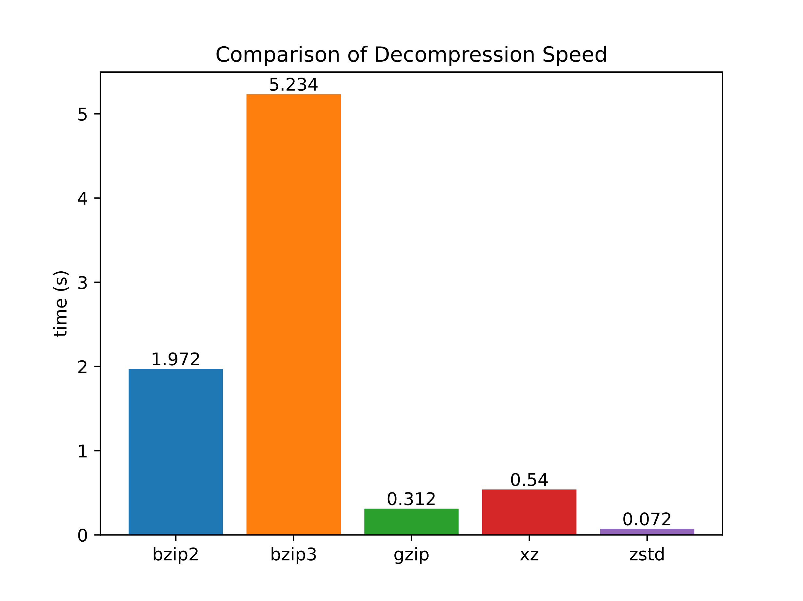
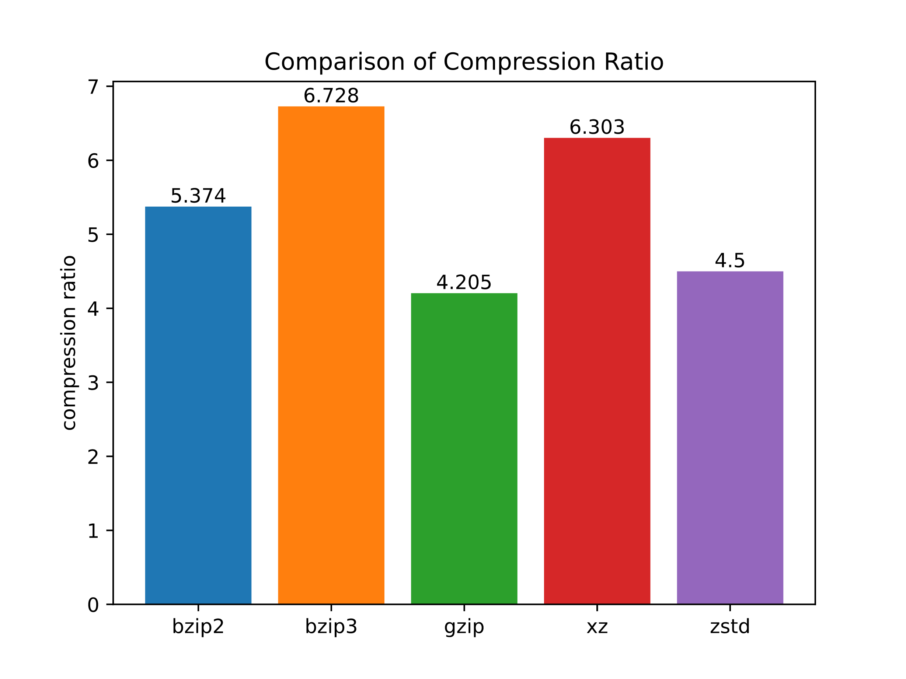

+++
title = "bzip2の後継の圧縮アルゴリズムのbzip3の紹介"
date = 2024-01-09T13:29:22+09:00
lastmod = 2024-03-02T00:49:16+09:00
draft = false
description = ""
summary = ""
categories = ["プログラミング"]
tags = ["compression", "bzip3"]
+++

## bzip3とは

bzip3は、2022年に登場した圧縮アルゴリズムです。
bzip2の後継を謳っており、連長圧縮（RLE）とLempel-Ziv + Prediction（LZP）、それに続くブロックソート（BWT）と算術符号を使用することによる高い圧縮率と優れたパフォーマンスを特徴としています。

リファレンス実装はC言語で書かれており、GNU Lesser General Public License v3.0（またはそれ以降）に基づいて配布されています。

リファレンス実装

: <https://github.com/kspalaiologos/bzip3>

## インストール方法

[](https://repology.org/project/bzip3/versions)

多くのOSの公式リポジトリでパッケージが提供されているので簡単にインストールすることができます。

## 使い方

他の圧縮アルゴリズムと同様に、それを実装したライブラリに加えて、ファイルの圧縮などを行うためのコマンドラインユーティリティが提供されています。

基本的にオプションは`gzip`などと同様ですが、圧縮レベルを指定するオプション（`-1`や`--best`）はbzip3では機能しないことから、バージョン1.4.0の時点では意図的に実装されていません[^1]。
圧縮率は`-b`または`--block`でブロックサイズを設定することで変化する場合があります。

また、`xz`や`zstd`などと同様に並列処理に対応しており、`-j`または`--jobs`で使用するスレッド数を指定することができます。

### 圧縮

```sh
bzip3 README.md
```

### 展開

```sh
bzip3 -d README.md.bz3
# または
bunzip3 README.md.bz3
```

## 他の圧縮アルゴリズムとの比較

[Git 2.43.0のtarball](https://mirrors.edge.kernel.org/pub/software/scm/git/git-2.43.0.tar.xz)を使用して他の圧縮アルゴリズムとの比較を行いました。
全てデフォルトの圧縮レベルでシングルスレッドで実行しています。

元のファイルサイズ

: 44.2 MiB (46,346,240 B)

### 圧縮

| Command                |       Mean [s] | Min [s] | Max [s] | Relative |
| :--------------------- | -------------: | ------: | ------: | -------: |
| `bzip2 git-2.43.0.tar` |  5.301 ± 0.060 |   5.216 |   5.385 |     1.00 |
| `bzip3 git-2.43.0.tar` |  5.421 ± 0.020 |   5.387 |   5.460 |     1.00 |
| `gzip git-2.43.0.tar`  |  1.864 ± 0.026 |   1.834 |   1.923 |     1.00 |
| `xz git-2.43.0.tar`    | 20.552 ± 0.105 |  20.388 |  20.688 |     1.00 |
| `zstd git-2.43.0.tar`  |  0.324 ± 0.005 |   0.316 |   0.333 |     1.00 |



### 展開

| Command                      |      Mean [s] | Min [s] | Max [s] | Relative |
| :--------------------------- | ------------: | ------: | ------: | -------: |
| `bunzip2 git-2.43.0.tar.bz2` | 1.972 ± 0.049 |   1.927 |   2.078 |     1.00 |
| `bunzip3 git-2.43.0.tar.bz3` | 5.234 ± 0.027 |   5.192 |   5.281 |     1.00 |
| `gunzip git-2.43.0.tar.gz`   | 0.312 ± 0.002 |   0.309 |   0.315 |     1.00 |
| `unxz git-2.43.0.tar.xz`     | 0.540 ± 0.006 |   0.532 |   0.549 |     1.00 |
| `unzstd git-2.43.0.tar.zst`  | 0.072 ± 0.003 |   0.067 |   0.083 |     1.00 |



### 圧縮後のファイルサイズ

| Format | Result [MiB] | Result [B] | Compression Ratio |
| :----- | -----------: | ---------: | ----------------: |
| bzip2  |          8.2 |  8,624,608 |             5.374 |
| bzip3  |          6.6 |  6,888,061 |             6.728 |
| gzip   |         10.5 | 11,021,005 |             4.205 |
| xz     |          7.0 |  7,352,912 |             6.303 |
| zstd   |          9.8 | 10,298,831 |             4.500 |



### 使用したコマンドのバージョン

| Command | Version |
| :------ | ------: |
| `bzip2` |   1.0.8 |
| `bzip3` |   1.4.0 |
| `gzip`  |    1.13 |
| `xz`    |   5.4.5 |
| `zstd`  |   1.5.5 |

これらの結果とリファレンス実装の[`README.md`](https://github.com/kspalaiologos/bzip3/blob/1.4.0/README.md)にあるベンチマークの結果を見た感じでは、`xz`以上の圧縮率をそれよりも短い時間で実現できるようです。

## ソフトウェアの対応状況

`file`のバージョン5.44以降はbzip3形式のファイルを認識することができます[^2]。

## 終わりに

圧縮率が高いことや`bzip2`とは異なり並列処理に対応していることから、圧縮率が重要な場合に`bzip2`や`xz`の代わりの選択肢になるかもしれないと思いました。
多くのOSの公式リポジトリでパッケージが提供されているので気軽に使い始めることができそうです。

[^1]: <https://github.com/kspalaiologos/bzip3/issues/78>

[^2]: <https://bugs.astron.com/view.php?id=395>
