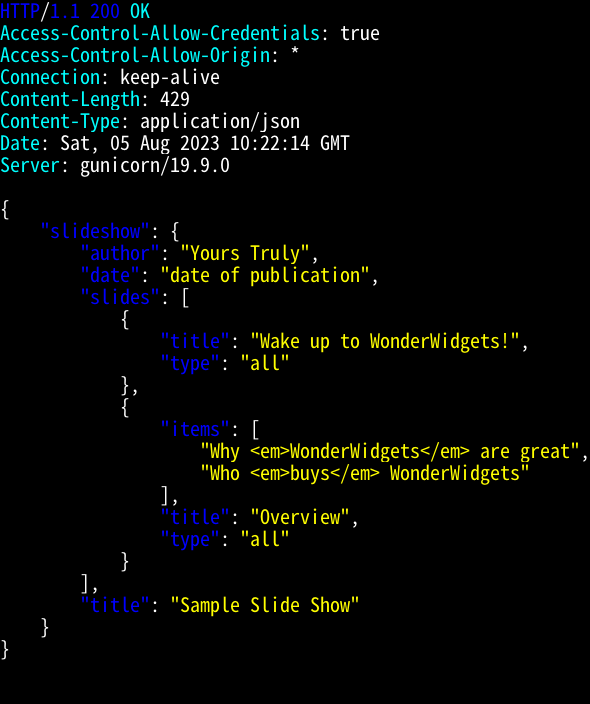
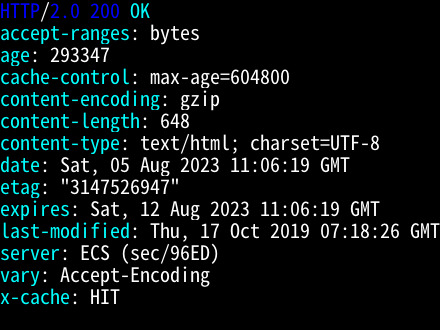

+++
title = "Rust製のHTTPieのxhを使ってみた"
date = 2023-08-05T21:06:00+09:00
lastmod = 2023-08-05T21:06:00+09:00
draft = false
description = ""
summary = ""
categories = ["プログラミング"]
tags = ["http", "httpie", "rust", "xh"]
+++

Rust製の[HTTPie](https://httpie.io/)のようなHTTPクライアントのxhを使ってみたので紹介します。

## xhとは

`xh`はHTTPリクエストを送信するための高速で使いやすいコマンドラインHTTPクライアントです[^1]。
パフォーマンスの向上に重点を置いており、HTTPieの優れた設計を可能な限り再実装しています[^1]。

## インストール

`xh`は以下のような方法でインストールすることができます[^2]。
完全な一覧については`xh`の`README.md`を参照して下さい[^2]。

### ソースコードから

[Cargo](https://doc.rust-lang.org/cargo/index.html)を利用してインストールすることができます。

```sh
cargo install xh
```

### Linux

Alpine Linuxではapkを利用してインストールすることができます。

```sh
apk add xh
```

Arch Linuxでは[pacman](https://archlinux.org/pacman/)を利用してインストールすることができます。

```sh
pacman -S xh
```

DebianやUbuntuではAPTを利用してインストールすることができます。

```sh
apt install xh
```

### macOS

macOSでは[Homebrew](https://brew.sh/)を利用してインストールすることができます。

```sh
brew install xh
```

## 使い方

`GET`リクエストを送信してみます。

```sh
xh httpbin.org/get
```

結果はHTTPieと同様に色付けされており、JSONがシンタックスハイライトされる点も同様です。



その他の使い方については[HTTPieのドキュメント](https://httpie.io/docs/cli)を参照して下さい。

## HTTPieとの比較

`xh`はHTTPieを可能な限り再実装していますが、以下のようなHTTPieにはない特徴が存在したり、逆にxhにはない特徴が存在したりするので、紹介します[^3]。

### 長所

#### Rust製

スクリプト言語であるPythonで実装されているHTTPieとは異なり、`xh`はRustで実装されているので起動速度が向上しています。
また、Rustで実装されているのでシングルバイナリにすることも可能で、インストールや配布を簡単に行うこともできます。

#### HTTP/2をサポート

`xh`はHTTP/2をサポートしています。
HTTPieはこの記事を書いた時点ではHTTP/2をサポートしていません[^4][^5]。

```sh
xh -h https://example.com
```



#### curlのコマンドへの変換機能

`--curl`オプションを使用することで`xh`のコマンドをそれと等価な`curl`のコマンドに変換することができます。

```sh
xh --curl --ssl tls1.3 https://example.com
```

変換した結果は以下のようになります。

```text
curl --tlsv1.3 --tls-max 1.3 https://example.com/
```

### 短所

`xh`はこの記事を書いた時点ではHTTPieの全ての機能を実装していません。
また、`xh`はプラグインには対応していません。

### その他の違い

#### TLSバックエンド

`xh`はデフォルトのTLSバックエンドとして[rustls](https://github.com/rustls/rustls)を使用します。
rustlsはTLS 1.2以降のみをサポートしているので、デフォルトでは`xh`でTLS 1.1などの古いプロトコルを使用することはできません。

```sh
xh --offline --ssl=tls1.1 :
```

以下のような警告が表示されます。

```text
xh: warning: rustls does not support older TLS versions. native-tls will be enabled. Use --native-tls to silence this warning.
```

TLS 1.1などの古いプロトコルを使用する場合は、コンパイル時に`native-tls`機能を有効にしてビルドした上で、実行時に`--native-tls`オプションを指定することで、OpenSSLなどのシステムのTLSライブラリをTLSバックエンドとして使用することができます。
この場合に使用できるプロトコルは、そのTLSライブラリに依存します。

```sh
xh --offline --ssl=tls1.1 --native-tls :
```

#### 出力

フォーマットされた出力は常にUTF-8です。

## 終わりに

Rust製のHTTPieのようなHTTPクライアントのxhを紹介しました。
起動速度が向上していることや、HTTP/2をサポートしているなどHTTPieにはない長所がかなりあると思いました。
また、古いバージョンのTLSをデフォルトではサポートしていない点も個人的には評価できます。
モダンなプロトコルをサポートした手軽に利用できるHTTPクライアントとして使ってみてはどうでしょうか。

[^1]: <https://github.com/ducaale/xh/tree/v0.18.0#xh>
[^2]: <https://github.com/ducaale/xh/tree/v0.18.0#installation>
[^3]: <https://github.com/ducaale/xh/tree/v0.18.0#how-xh-compares-to-httpie>
[^4]: [curl vs HTTPie](https://daniel.haxx.se/docs/curl-vs-httpie.html)
[^5]: [Support HTTP/2 (httpie-http2 plugin doesn't work) · Issue #692](https://github.com/httpie/cli/issues/692)
