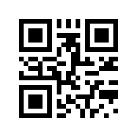
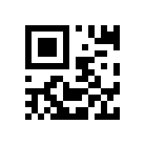

+++
title = "qrtoolのバージョン0.7.0を公開しました"
date = 2023-07-15T08:02:01+09:00
lastmod = 2024-03-19T18:02:55+09:00
draft = false
description = ""
summary = ""
categories = ["プログラミング"]
tags = ["qrcode", "qrtool", "rust"]
+++

協定世界時 (UTC) の2023年7月12日にQRコードのエンコードとデコードを行うためのコマンドラインユーティリティの`qrtool`のバージョン0.7.0を公開しました。

この記事では、`qrtool`の紹介と、バージョン0.7.0の主な変更点について書こうと思います。

## qrtoolとは

[`qrtool`](https://github.com/sorairolake/qrtool)はQRコードのエンコードとデコードを行うためのコマンドラインユーティリティで、エンコードを行うサブコマンドの`encode`と、デコードを行うサブコマンドの`decode`で構成されています。
`encode`については[`qrencode`](https://fukuchi.org/works/qrencode/)の影響を受けており、`decode`については[`zbarimg`](https://github.com/mchehab/zbar)の影響を受けています。

## 機能

- 誤り訂正レベルの設定 (`-l`)
- シンボルのバージョンの設定 (`-v`)
- マージンの設定 (`-m`)
- モードの設定 (`--mode`)
- マイクロQRコードの出力に対応 (`--variant`)
- 前景色と背景色の設定 (`--foreground`、`--background`)

### 対応する出力形式

`encode`サブコマンドは以下の3種類の出力形式に対応しています。

- PNG (32ビットRGBA、既定値)
- SVG
- ターミナルへの出力 (UTF-8文字列)

PNGとSVG以外の画像形式については、[ImageMagick](https://imagemagick.org/)などによって容易に変換することができるので、これらを利用することを想定しています。

### 対応する入力形式

`decode`サブコマンドが対応する入力形式は[`image`](https://crates.io/crates/image)クレートがデコードできる画像形式で、以下の画像形式です。

- BMP
- DDS
- Farbfeld
- GIF
- RGBE
- ICO
- JPEG
- OpenEXR
- PNG
- PNM
- QOI
- TGA
- TIFF
- WebP

また、SVG画像を入力することにも対応しています。
SVG画像の入力については[`resvg`](https://crates.io/crates/resvg)クレートに依存しており、ビルド時に`--no-default-features`オプションを指定することで無効にすることができます。

## インストール方法

[crates.io](https://crates.io/)からインストールする場合は、以下のコマンドを実行します。

```sh
cargo install qrtool
```

また、GitHubの[リリースページ](https://github.com/sorairolake/qrtool/releases)でLinux、macOS及びWindows向けの実行ファイルとドキュメントを含んだアーカイブファイル[^1]を公開しているので、これをダウンロードして利用することもできます。

## 使い方

### 基本的なエンコード方法

UTF-8文字列をQRコードにエンコードしてPNG画像として出力するには以下のコマンドを実行します。

```sh
qrtool encode "QR code" > output.png
```

エンコードした結果は以下のようになります。



エンコードするデータの入力は、以下のいずれかの方法によって行います。

1. 位置引数に文字列を指定する (UTF-8文字列の場合のみ利用可能)
2. `-r`オプションでファイルを指定する
3. 位置引数を省略して、標準入力からデータを読み取る (UTF-8文字列以外も入力可能)

### 基本的なデコード方法

基本的なエンコード方法で出力したPNG画像をデコードするには以下のコマンドを実行します。

```sh
qrtool decode output.png
```

デコードした結果は以下のようになります。

```text
QR code
```

位置引数に画像ファイルを指定しなかった場合と、`-`を指定した場合は、データは標準入力から読み取られます。

入力された画像の形式は拡張子やマジックナンバーを基に決定されます。
これが失敗する場合は、`-t`オプションで明示的に画像形式を指定して下さい。

### エンコードした結果をSVG画像として出力する

`encode`サブコマンドはデフォルトではPNG画像を出力しますが、エンコードした結果をSVG画像として出力する場合は以下のコマンドを実行します。

```sh
qrtool encode -o output.svg -t svg "QR code"
```

この例では`-t`オプションで出力形式としてSVGを指定しています。
また、`-o`オプションではエンコードした結果を出力するファイルを指定しています。
デフォルトでは、エンコードした結果は標準出力に出力されます。

### マイクロQRコードを出力する

マイクロQRコードを出力するには以下のコマンドを実行します。

```sh
qrtool encode -v 3 --variant micro "QR code" > output.png
```

エンコードした結果は以下のようになります。



なお、マイクロQRコードを出力する場合は`-v`オプションでシンボルのバージョンを指定する必要があります。

### 前景色や背景色を変更したQRコードを出力する

前景色にCSSの`<named-color>`の`brown`を指定して出力するには以下のコマンドを実行します。

```sh
qrtool encode --foreground brown "QR code" > output.png
```

エンコードした結果は以下のようになります。


`--foreground`と`--background`には[CSS Color Module Level 4](https://www.w3.org/TR/css-color-4/)[^2]で定義されている色の値を指定することができます。
`--foreground`の既定値は`<named-color>`の`black` (`#000000`) で、`--background`の既定値は`<named-color>`の`white` (`#ffffff`) です。

### シェル補完スクリプトの生成

`--generate-completion`オプションを指定することでシェル補完スクリプトを生成することができます。

```sh
qrtool --generate-completion bash > qrtool.bash
```

以下のシェルの補完スクリプトを生成することができます[^3]。

- Bash
- Elvish
- Fish
- PowerShell
- Zsh

### 別のコマンドとの連携

`encode`サブコマンドと`decode`サブコマンドはどちらも標準入力からの読み取りと標準出力への書き込みに対応しているので、[フィルタープログラム](<https://ja.wikipedia.org/wiki/%E3%83%95%E3%82%A3%E3%83%AB%E3%82%BF_(%E3%82%BD%E3%83%95%E3%83%88%E3%82%A6%E3%82%A7%E3%82%A2)>)として利用することもできます。

以下の例では、`Cargo.toml`の内容を標準入力から読み取って、QRコードにエンコードした結果をPNG画像として標準出力に出力して、ImageMagickの`magick`コマンドでPNG画像からJPEG XL画像に変換しています。

```sh
cat Cargo.toml | qrtool encode | magick png:- output.jxl
```

以下の例では、`magick`コマンドでJPEG XL画像からPNG画像に変換したQRコードを標準入力から読み取って、これをデコードした結果を標準出力に出力し、[`bat`](https://github.com/sharkdp/bat)コマンドでTOMLとしてシンタックスハイライトして表示しています。

```sh
magick output.jxl png:- | qrtool decode | bat -l toml
```

## バージョン0.7.0の主な変更点

### QOI画像形式を明示的に指定できるようになった

`image`クレートのバージョン0.24.6から[QOI](https://qoiformat.org/)画像形式に対応していたので、`qrtool`のバージョン0.6.0の時点で`-t`オプションを指定しない場合にはQOI画像を入力することに対応していました。

しかし、READMEの対応する画像形式についての表には載っていなかったことから対応していることに気が付かず[^4]、`-t`オプションでQOI画像形式を指定することができない状態でした。

なので、この問題に対応するために`-t`オプションの値に`qoi`を追加しました。

### 前景色と背景色を指定する際に指定できる値の種類を増やした

従来は独自に値をパースしており、16進数表記 (`#ff0000`など) にだけ対応していました。
独自にパースするのを止めたいと考え、[`csscolorparser`](https://crates.io/crates/csscolorparser)クレートを利用するように変更しました。
この結果として、`rgb()`関数表記や`hsl()`関数表記などでも前景色と背景色を指定できるようになりました。

### manページなどのドキュメントのライセンスをCC BY 4.0に変更した

従来はドキュメントも含めてプロジェクト全体に*Apache License 2.0*と*MIT License*のデュアルライセンスとしていましたが、これらのライセンスはドキュメントには適していないことや、プロジェクトの人間の貢献者が自分だけでライセンスの変更が容易なので、manページなどのドキュメントのライセンスをこれらにより適した*CC BY 4.0*に変更しました。

### ラスター画像の形式の決定に拡張子も利用するように変更した

従来はラスター画像の形式はマジックナンバーだけを基に決定していましたが、拡張子も利用するように変更しました。
これによって、TGA形式の画像を入力する場合に明示的に画像形式を指定することが必須ではなくなりました。

## 終わりに

`qrtool`とバージョン0.7.0の主な変更点の紹介をしました。

詳細な利用方法は[qrtool Documentation](https://sorairolake.github.io/qrtool/)のmanページでも確認することができます。

気に入ってもらえたら[sorairolake/qrtool](https://github.com/sorairolake/qrtool)でStarを付けてもらえるとありがたいです。
`qrtool`の改善のために[Issue](https://github.com/sorairolake/qrtool/issues)や[Pull Request](https://github.com/sorairolake/qrtool/pulls)もお待ちしています。

[^1]: アーカイブの種類は`.tar.zst` (Linux、macOS) と`.7z` (Windows) です。
[^2]: [MDN Web Docs](https://developer.mozilla.org/ja/docs/Web/CSS/color_value)を参照。
[^3]: [`clap_complete`](https://crates.io/crates/clap_complete)クレートに基づきます。
[^4]: [#1948](https://github.com/image-rs/image/issues/1948)に基づき修正済み。
